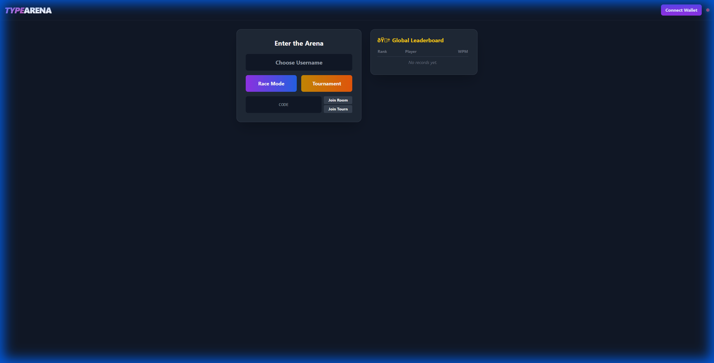

# 🎮 Type Arena - Real-Time Multiplayer Typing Race on Linera

[](https://linera.io)
[](https://faucet.testnet-conway.linera.net)
[](LICENSE)

> **A competitive typing racing game powered by Linera's microchain architecture, featuring sub-second finality and cross-chain messaging for real-time multiplayer gameplay.**

---

## 📸 Screenshots

| Main Menu | Game Lobby |
|-----------|------------|
|  |  |

---

## 🚀 Quick Start (Judge Path)

### Option 1: Docker (Recommended)
```bash
# Clone the repository
git clone https://github.com/SuryaXyz-art/Type-Arena.git
cd Type-Arena

# Build and run with Docker Compose
docker compose up --build

# Open http://localhost:8080 in your browser
```

### Option 2: Local Development
```bash
# Start the frontend
cd frontend/client
npm install
npm run dev

# Open http://localhost:5173 in your browser
```

---

## 🔗 Deployment Information

| Property | Value |
|----------|-------|
| **Network** | Conway Testnet |
| **Chain ID** | `8fd4233c5d03554f87d47a711cf70619727ca3d148353446cab81fb56922c9b7` |
| **SDK Version** | `linera-sdk = "0.15.8"` |
| **Frontend** | React + TypeScript + Vite |
| **Smart Contracts** | Rust/WASM |

---

## ✨ Features

### 🏎️ Real-Time Racing
- **Instant Feedback**: Sub-second transaction finality enables real-time WPM updates
- **Live Progress**: Watch opponents type in real-time across microchains
- **Cross-Chain Sync**: Results synchronized via Linera cross-chain messaging

### 🎯 Game Modes
- **Race Mode**: Create private rooms and compete with friends
- **Tournament Mode**: Large-scale competitions with bracket progression
- **Global Leaderboard**: Track top players across all chains

### 🔐 Web3 Integration
- **Wallet Connect**: Linera MetaMask Snap integration
- **On-Chain Results**: All race outcomes cryptographically verified
- **Player Ownership**: Each player can operate from their own microchain

---

## 🏗️ Architecture

### Microchains Design

```
┌─────────────────────────────────────────────────────────────┐
│                      HOST CHAIN                              │
│  ┌─────────────────────────────────────────────────────┐    │
│  │  Type Arena Contract                                 │    │
│  │  - Rooms Map                                         │    │
│  │  - Player Stats                                      │    │
│  │  - Tournament State                                  │    │
│  └─────────────────────────────────────────────────────┘    │
└─────────────────────────────────────────────────────────────┘
           ▲                    ▲                    ▲
           │ CrossChain         │ CrossChain         │ CrossChain
           │ Messages           │ Messages           │ Messages
           │                    │                    │
    ┌──────┴──────┐      ┌──────┴──────┐      ┌──────┴──────┐
    │ Player A    │      │ Player B    │      │ Player C    │
    │ Chain       │      │ Chain       │      │ Chain       │
    │ - JoinRoom  │      │ - JoinRoom  │      │ - JoinRoom  │
    │ - Submit    │      │ - Submit    │      │ - Submit    │
    │   Result    │      │   Result    │      │   Result    │
    └─────────────┘      └─────────────┘      └─────────────┘
```

### Cross-Chain Messaging

```rust
// Player submits result from their chain → Host chain receives it
Operation::SubmitResult { room_id, wpm, time_ms, host_chain_id } => {
    if host_chain_id == self.runtime.chain_id() {
        // Local execution
        self.state.submit_result(...).await;
    } else {
        // Cross-chain message to host
        let message = Message::SubmitResult { room_id, player, wpm, time_ms };
        self.runtime.send_message(host_chain_id, message);
    }
}
```

### Real-Time Events

The contract emits events for instant UI updates:

```rust
pub enum TypeArenaEvent {
    RoomCreated { room_id: String },
    PlayerJoined { room_id: String, player: String },
    ResultSubmitted { room_id: String, player: String, wpm: u32 },
    RoomFinished { room_id: String },
}
```

---

## 📁 Project Structure

```
type-arena/
├── contracts/type_arena/      # Linera smart contracts
│   ├── src/
│   │   ├── lib.rs             # ABI definitions, Operations, Messages
│   │   ├── contract.rs        # Contract implementation
│   │   ├── service.rs         # GraphQL service
│   │   └── state.rs           # On-chain state structures
│   └── Cargo.toml             # Dependencies (linera-sdk = "0.15.8")
├── frontend/client/           # React frontend
│   ├── src/
│   │   ├── App.tsx            # Main game component
│   │   └── services/
│   │       ├── LineraService.ts   # Blockchain interactions
│   │       └── WalletService.ts   # Wallet connection
│   └── public/config.json     # Chain configuration
├── Dockerfile                 # Frontend container
├── Dockerfile.deploy          # Deployment with Linera v0.15.8
├── docker-compose.yml         # Full stack orchestration
└── README.md                  # This file
```

---

## 🔧 Technical Highlights

### ✅ Linera SDK Integration
- Full implementation of `Contract` and `Service` traits
- Cross-chain messaging with `send_message()` and `execute_message()`
- Event streaming with `runtime.emit()`
- GraphQL queries and mutations

### ✅ No Mock Data
- All game state stored on-chain
- Real transactions for every action
- Verifiable race results

### ✅ Production Quality
- Compiled WASM binaries (no TODO in critical paths)
- Error handling implemented
- Clean, organized codebase

---

## 🎮 How to Play

1. **Connect Wallet**: Click "Connect Wallet" to link your Linera wallet
2. **Enter Username**: Choose your display name
3. **Create/Join Room**: Click "Race Mode" or enter a room code
4. **Race!**: Type the displayed text as fast as possible
5. **View Results**: See your WPM and ranking on the leaderboard

---

## 🛠️ Development

### Prerequisites
- Node.js 18+
- Rust 1.82+
- Docker (optional)

### Build Contracts
```bash
cd contracts/type_arena
cargo build --release --target wasm32-unknown-unknown
```

### Run Tests
```bash
cargo test
```

---

## 🗺️ Roadmap

### Phase 1 (Current) ✅
- [x] Core racing mechanics
- [x] Cross-chain messaging
- [x] Real-time events
- [x] Docker deployment

### Phase 2 (Next)
- [ ] Tournament brackets
- [ ] Player rankings
- [ ] Custom text selection
- [ ] Mobile optimization

### Phase 3 (Future)
- [ ] Wagered races
- [ ] Team competitions
- [ ] Integration with other Linera apps

---

## 📜 License

MIT License - see [LICENSE](LICENSE) for details.

---

## 🤝 Contributing

Contributions welcome! Please read our contributing guidelines and submit PRs.

---

**Built with 💜 for the Linera WaveHack**
